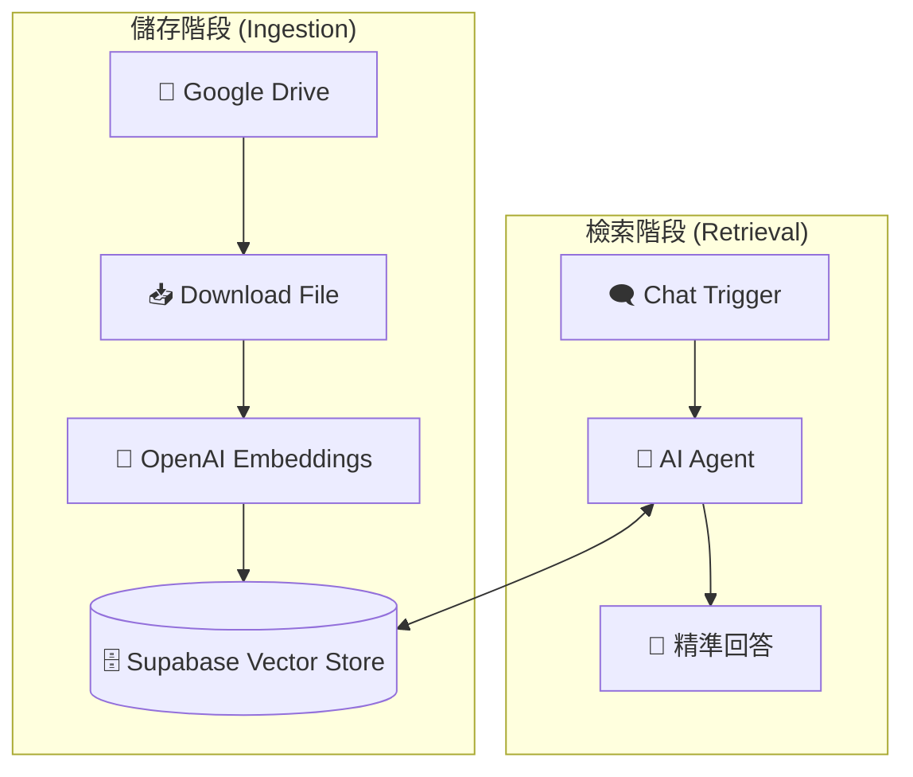

# 📚 n8n AI RAG System: Supabase 向量資料庫自動化

本專案包含一組完整的 RAG (Retrieval-Augmented Generation) 工作流，實現了從 **Google Drive 檔案自動向量化儲存** 到 **AI Agent 智能檢索檢索** 的全自動化流程。

## 📖 流程簡介

本系統由兩個核心工作流組成：

### 1. 向量儲存流程 (Data Ingestion)
當 Google Drive 中有新檔案更新時，系統會自動執行：
* **下載與讀取**：自動從 Google Drive 下載檔案並讀取內容。
* **文本嵌入 (Embedding)**：利用 OpenAI 模型將文字轉換為向量數據。
* **持久化儲存**：將向量數據存入 Supabase Vector Store。

### 2. 數據提取與問答 (RAG Retrieval)
透過對話介面，AI Agent 會執行以下步驟：
* **意圖識別**：判斷問題是否需要檢索外部知識庫。
* **相似度搜索**：從 Supabase 中提取與問題最相關的資料片段。
* **總結回覆**：結合檢索到的資料，給出精準且具備事實根據的回答。

---

## 🛠️ 節點配置說明

### 核心技術棧
* **LLM**: OpenAI `gpt-4o-mini`
* **Embedding**: OpenAI `text-embedding-3-small`
* **Vector Store**: Supabase (pgvector)
* **Storage**: Google Drive

### 關鍵參數
* **Table Name**: `documents`
* **Query Name**: `match_documents`
* **System Message**: 「回答問題之前，請先去 Supabase 獲得資料後再回答」

---

## 🚀 安裝與設置

### 1. 資料庫準備 (Supabase)
請確保您的 Supabase 已啟用 `pgvector` 擴展，並建立對應的 `documents` 表與 `match_documents` 函數。
可以下載提供的文件檔案。

### 2. 匯入工作流
* 匯入 `Data Ingestion.json`：處理資料寫入。
* 匯入 `RAG Retrieval.json`：處理問答檢索。
* 並在您的 n8n 面板選擇 **"Import from File"** 進行匯入。

### 3. 設定憑證
* **OpenAI**: 提供 Embedding 與 LLM 服務。
* **Supabase**: 提供向量存取服務。
* **Google Drive**: 用於讀取原始知識庫檔案。

### 🗄️ Supabase 資料庫設定 (SQL)
請在 Supabase 的 SQL Editor 中執行以下指令，以建立相容於此工作流的向量資料表：

```sql
-- 1. 啟用 pgvector 擴展
create extension if not exists vector;

-- 2. 建立儲存文件的資料表
create table documents (
  id bigserial primary key,
  content text, -- 對應 n8n 的 metadata 內容
  metadata jsonb,
  embedding vector(1536) -- OpenAI text-embedding-3-small 使用 1536 維度
);

-- 3. 建立相似度檢索函數 (match_documents)
create or replace function match_documents (
  query_embedding vector(1536),
  match_threshold float,
  match_count int
)
returns table (
  id bigint,
  content text,
  metadata jsonb,
  similarity float
)
language plpgsql
as $$
begin
  return query
  select
    documents.id,
    documents.content,
    documents.metadata,
    1 - (documents.embedding <=> query_embedding) as similarity
  from documents
  where 1 - (documents.embedding <=> query_embedding) > match_threshold
  order by similarity desc
  limit match_count;
end;
$$;
```

### 📊 流程結構



## 📸 執行截圖範例


圖：AI Agent 成功從向量資料庫中提取專業知識並回答使用者問題。
